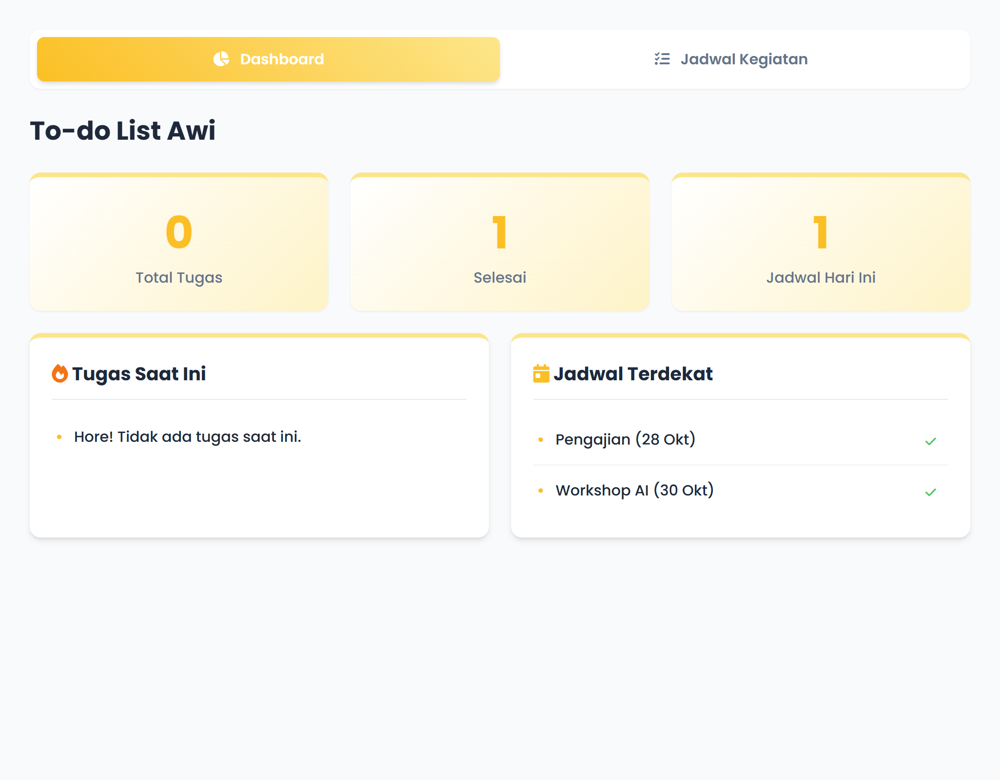
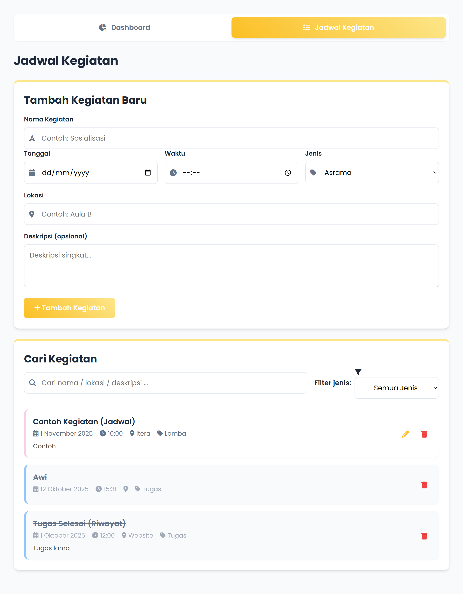

# Aplikasi To-do List Awi

Repository ini berisi proyek **Aplikasi To-do List Awi**, yang dikembangkan untuk mengelola tugas dan jadwal kegiatan pribadi.

- **Nama: Awi Septian Prasetyo**
- **NIM: 123140201**
- **Program Studi: Teknik Informatika**

---

## Deskripsi Aplikasi

Aplikasi **To-do List Awi** ini adalah *personal dashboard* sederhana yang dirancang untuk membantu mengelola daftar tugas ("Tugas Saat Ini") dan jadwal kegiatan ("Jadwal Terdekat").
Aplikasi berjalan sepenuhnya di sisi klien (*client-side*) menggunakan **HTML, CSS, dan JavaScript murni (Vanilla JS)**, serta menyimpan semua data secara lokal melalui **`localStorage`**.

Ini memastikan bahwa semua daftar kegiatan Anda akan tetap tersimpan di browser meskipun halaman di-*refresh* atau ditutup.

---

## Fitur Utama

-   **Dashboard Ringkasan:** Menampilkan jumlah total tugas aktif, jumlah kegiatan yang sudah selesai, dan jumlah kegiatan yang dijadwalkan hari ini.
-   **Daftar Tugas & Jadwal:** Menampilkan daftar "Tugas Saat Ini" (khusus item berjenis "Tugas") dan "Jadwal Terdekat" (untuk jenis kegiatan lainnya) yang belum selesai.
-   **Tandai Selesai:** Item di *dashboard* dapat ditandai sebagai selesai langsung dari *dashboard*.
-   **Manajemen Kegiatan (CRUD):**
    -   **Tambah:** Menambah kegiatan baru (termasuk tugas) melalui form di halaman "Jadwal Kegiatan".
    -   **Edit:** Mengubah detail kegiatan yang sudah ada melalui form yang sama.
    -   **Hapus:** Menghapus kegiatan (termasuk yang sudah selesai) dari daftar.
-   **Filter & Pencarian:** Mencari kegiatan berdasarkan nama, lokasi, atau deskripsi, serta memfilter berdasarkan jenis kegiatan di halaman "Jadwal Kegiatan".
-   **Riwayat Kegiatan:** Kegiatan yang sudah ditandai selesai akan tetap terlihat (tercoret) di halaman "Jadwal Kegiatan" dan dapat dihapus jika diinginkan.
-   **Penyimpanan Lokal:** Semua data kegiatan tersimpan aman di `localStorage` browser.
-   **Responsif & Interaktif:** Desain berbasis *card* yang mencoba menyesuaikan dengan ukuran layar.

---

## Tampilan Aplikasi

**1. Beranda / Dashboard**


**2. Jadwal Kegiatan**


---

## Penjelasan Teknis

### Penyimpanan Data – `localStorage`

Semua data kegiatan disimpan sebagai *array* objek dalam `localStorage` dengan kunci (key) `"daftarKegiatan"`. Data diambil saat aplikasi dimuat dan disimpan setiap kali ada perubahan (tambah, edit, hapus, tandai selesai) menggunakan metode `async/await` untuk memastikan konsistensi.

```javascript
// Contoh memuat data (di dalam class KegiatanManager)
async loadData() {
    // ... logika ambil dari localStorage ...
    const dataDariStorage = localStorage.getItem(this.storageKey);
    // ... parse dan map ke class Kegiatan ...
}

// Contoh menyimpan data (di dalam class KegiatanManager)
async saveData() {
    localStorage.setItem(this.storageKey, JSON.stringify(this.kegiatan));
    // ...
}
```
### Struktur File

```
📁 Aplikasi-Dashboard-Mahasiswa
├── index.html
├── style.css
├── script.js
└── README.md
```

### Bahasa & Teknologi

- HTML5
- CSS3  
- JavaScript (ES6+):
    - Arrow functions
    - Template literals
    - Class (class Kegiatan)
    - Async/await (fetch API)
    - let & const

---

## Cara Menjalankan

1. Unduh atau clone repository ini.  
2. Buka file `index.html` menggunakan browser favorit Anda.  
3. Aplikasi siap digunakan tanpa perlu server tambahan.
